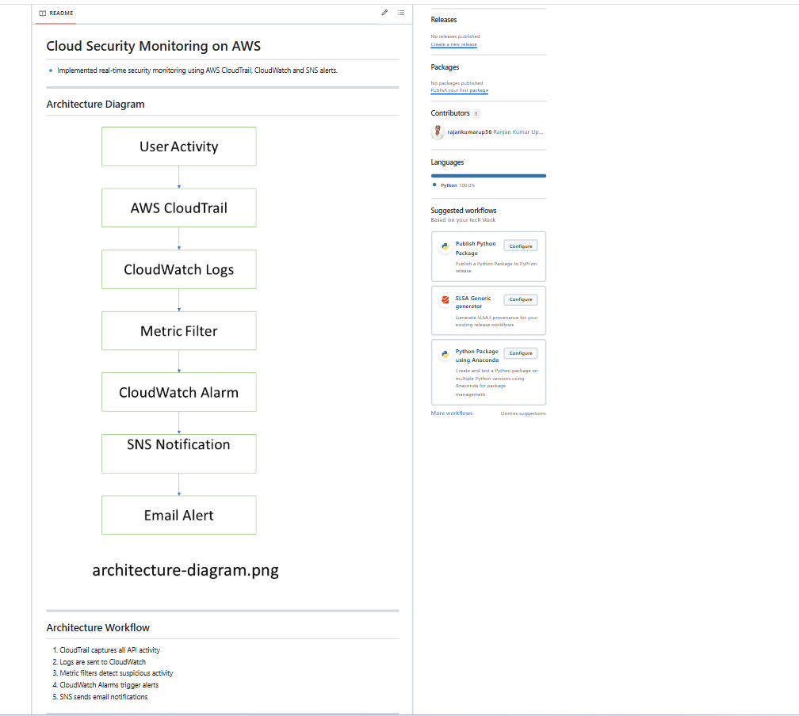
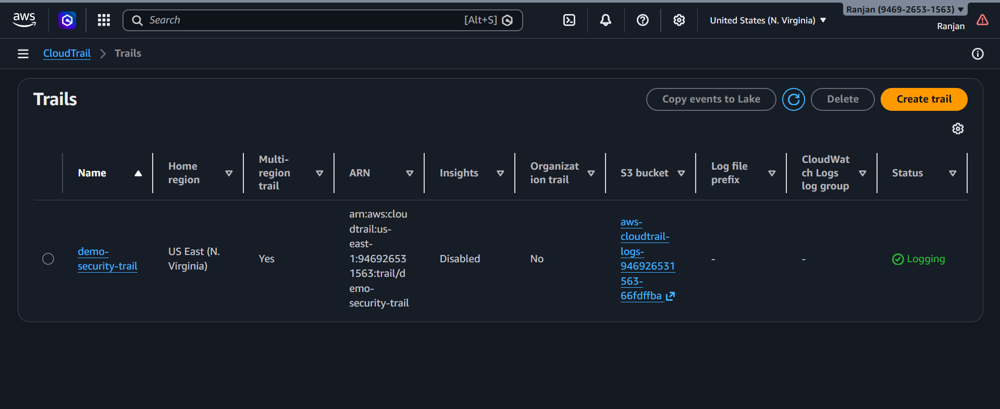
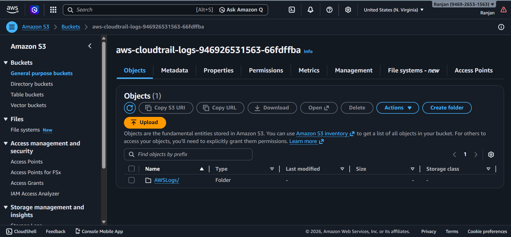

# 🔐 Cloud Security Monitoring on AWS

## 📌 Overview

This project simulates a real-world cloud security monitoring system used in production environments.

It demonstrates a real-time AWS security monitoring pipeline using:

* AWS CloudTrail (activity tracking)
* Amazon CloudWatch (log monitoring & alarms)
* Metric Filters & Alerts (threat detection)
* SNS (real-time notifications)

---

## 🏗️ Architecture Diagram



---

## ⚙️ Architecture Workflow

1. CloudTrail captures all API activity
2. Logs are sent to CloudWatch
3. Metric filters detect suspicious activity
4. CloudWatch alarms trigger alerts
5. SNS sends email notifications

---

## 📸 Project Screenshots

### 🔹 Repository Overview



---

### 🔹 CloudTrail Setup


---

### 🔹 S3 Log Storage



---

### 🔹 CloudWatch Alarms & Monitoring


---

### 🔹 SNS Notifications


---

## 🚀 Key Features

* Real-time AWS activity monitoring
* Automated threat detection using metric filters
* Alert system using SNS notifications
* Secure logging and storage using S3
* Scalable and production-ready architecture

---

## 🛠️ Tech Stack

* AWS CloudTrail (Activity Tracking)
* Amazon CloudWatch (Monitoring & Alerts)
* AWS SNS (Notifications)
* Amazon S3 (Log Storage)
* Terraform (Infrastructure as Code)

---

## 📂 Project Structure

```
.
├── architecture/
├── lambda/
├── terraform/
├── architecture.png
├── repository-overview.png
├── cloudtrail-setup.png
├── cloudwatch-alarms.png
├── s3-log-storage.png
├── sns-notifications.png
└── README.md
```

---

## 🎯 Conclusion

This project showcases a complete AWS security monitoring pipeline that detects and alerts on suspicious activities in real time. It highlights practical experience with cloud security, monitoring, and DevOps practices.

---

## 👨‍💻 Author

**Ranjan Kumar Upadhyay**
