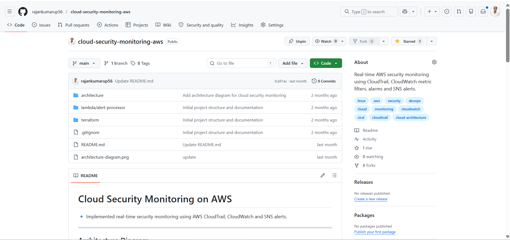
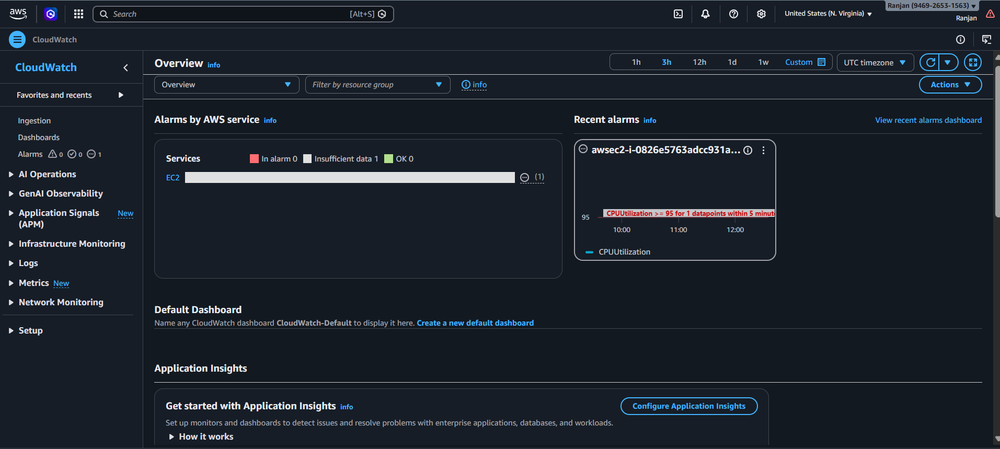
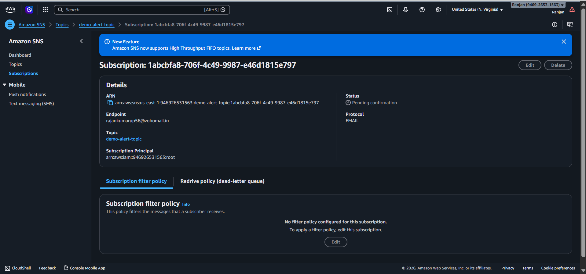

# 🔐 Cloud Security Monitoring on AWS

## 📌 Overview

This project simulates a real-world cloud security monitoring system used in production environments.

This project demonstrates a real-time AWS security monitoring system using:

- AWS CloudTrail (activity tracking)
- Amazon CloudWatch (log monitoring)
- Metric Filters & Alarms (threat detection)
- SNS (alert notifications)

---

## 🏗️ Architecture Diagram


---

## ⚙️ Architecture Workflow

1. CloudTrail captures all API activity  
2. Logs are sent to CloudWatch  
3. Metric filters detect suspicious activity  
4. CloudWatch alarms trigger alerts  
5. SNS sends email notifications  

---

## 📸 Project Screenshots

### 🔹 Repository Overview


---

### 🔹 CloudTrail Setup


---

### 🔹 S3 Logs Storage


---

### 🔹 CloudWatch Alarms & Monitoring


---

### 🔹 SNS Alerts


---

## 🚀 Key Features

- Real-time AWS activity monitoring  
- Automated threat detection using metric filters  
- Alert system using SNS notifications  
- Secure logging and storage using S3  
- Scalable and production-ready architecture  

---

## 🛠️ Tech Stack

- AWS CloudTrail (Activity Tracking)  
- Amazon CloudWatch (Logs & Monitoring)  
- AWS SNS (Notifications)  
- Amazon S3 (Log Storage)  
- Terraform (Infrastructure as Code)  

## 📂 Project Structure

```
.
├── architecture/
├── lambda/
├── terraform/
├── architecture-diagram.png
├── cloudtrail-dashboard.png
├── cloudwatch-logs.png
├── s3-logs.png
├── sns-alert.png
├── repo-overview.png
└── README.md
```

## 🎯 Conclusion

This project showcases a complete AWS security monitoring pipeline that detects and alerts on suspicious activities in real time. It highlights hands-on experience with cloud security, monitoring, and DevOps practices.

---

## 👨‍💻 Author

**Ranjan Kumar Upadhyay**
